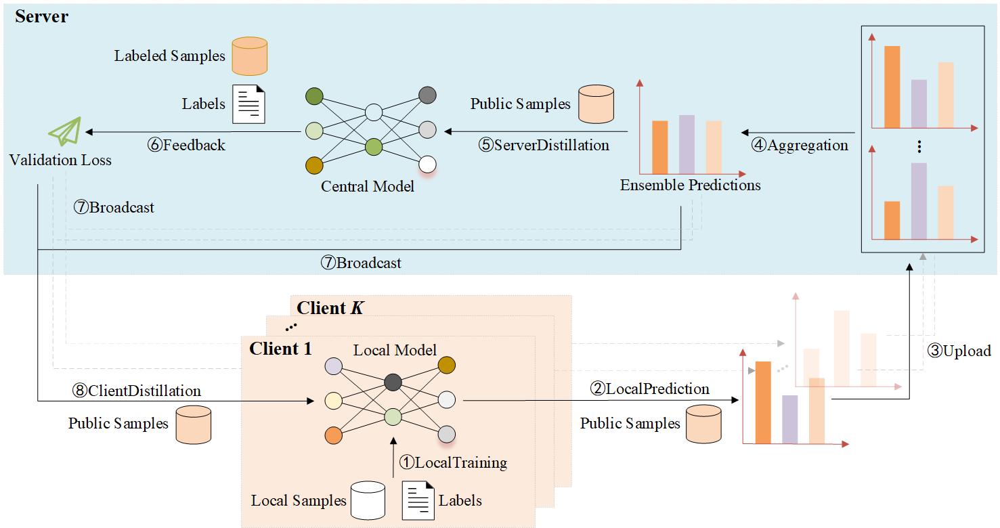

# FedID

This repository contains an implementation with PyTorch for the paper "**FedID: Federated Interactive Distillation for Large-Scale Pretraining Language Models**". The figure below illustrates an overview of the proposed federated distillation framework of FedID.



For more details about the technical details of FedID, please refer to our paper.

**Installation**

Run command below to install the environment (using python3):

```
pip install -r requirements.txt
```

**Usage**

Run command below to run by setting `--algorithm centralized`,  `--algorithm fed_avg` , `--algorithm fed_df`, `--algorithm fed_ed`, `--algorithm fed_kd`, `--algorithm ds_fl`, `--algorithm mhat`,  and `--algorithm fed_id` to perform different training paradigms:

```
# WNLI
python main.py \
  --seed 42 \
  --algorithm centralized \
  --dataset glue \
  --task_name wnli \
  --data_dir ./data \
  --public_ratio 0.5 \
  --labeled_public_ratio 0.1 \
  --alpha 1 \
  --K 10 \
  --C 1 \
  --R 10 \
  --E 3 \
  --lr 2e-5 \
  --dis_epochs 3 \
  --dis_lr 2e-5
  --max_seq_length 128 \
  --batch_size 32 \
  --central_model bert-base-uncased
  --local_models bert-base-uncased,bert-base-uncased,bert-base-uncased,bert-base-uncased,bert-base-uncased,bert-base-uncased,bert-base-uncased,bert-base-uncased,bert-base-uncased,bert-base-uncased \
  --optimizer adamw \
  --scheduler linear \
  --output_dir ./saves \
  --do_test
  
# RTE
python main.py \
  --seed 42 \
  --algorithm centralized \
  --dataset glue \
  --task_name rte \
  --data_dir ./data \
  --public_ratio 0.5 \
  --labeled_public_ratio 0.1 \
  --alpha 1 \
  --K 10 \
  --C 1 \
  --R 10 \
  --E 3 \
  --lr 2e-5 \
  --dis_epochs 3 \
  --dis_lr 2e-5
  --max_seq_length 128 \
  --batch_size 32 \
  --central_model bert-base-uncased
  --local_models bert-base-uncased,bert-base-uncased,bert-base-uncased,bert-base-uncased,bert-base-uncased,bert-base-uncased,bert-base-uncased,bert-base-uncased,bert-base-uncased,bert-base-uncased \
  --optimizer adamw \
  --scheduler linear \
  --output_dir ./saves \
  --do_test

# MRPC
python main.py \
  --seed 42 \
  --algorithm centralized \
  --dataset glue \
  --task_name mrpc \
  --data_dir ./data \
  --public_ratio 0.5 \
  --labeled_public_ratio 0.1 \
  --alpha 1 \
  --K 10 \
  --C 1 \
  --R 10 \
  --E 3 \
  --lr 2e-5 \
  --dis_epochs 3 \
  --dis_lr 2e-5
  --max_seq_length 128 \
  --batch_size 32 \
  --central_model bert-base-uncased
  --local_models bert-base-uncased,bert-base-uncased,bert-base-uncased,bert-base-uncased,bert-base-uncased,bert-base-uncased,bert-base-uncased,bert-base-uncased,bert-base-uncased,bert-base-uncased \
  --optimizer adamw \
  --scheduler linear \
  --output_dir ./saves \
  --do_test

# CoLA
python main.py \
  --seed 42 \
  --algorithm centralized \
  --dataset glue \
  --task_name cola \
  --data_dir ./data \
  --public_ratio 0.5 \
  --labeled_public_ratio 0.1 \
  --alpha 1 \
  --K 10 \
  --C 1 \
  --R 10 \
  --E 3 \
  --lr 2e-5 \
  --dis_epochs 3 \
  --dis_lr 2e-5
  --max_seq_length 128 \
  --batch_size 32 \
  --central_model bert-base-uncased
  --local_models bert-base-uncased,bert-base-uncased,bert-base-uncased,bert-base-uncased,bert-base-uncased,bert-base-uncased,bert-base-uncased,bert-base-uncased,bert-base-uncased,bert-base-uncased \
  --optimizer adamw \
  --scheduler linear \
  --output_dir ./saves \
  --do_test

# SST-2
python main.py \
  --seed 42 \
  --algorithm centralized \
  --dataset glue \
  --task_name sst2 \
  --data_dir ./data \
  --public_ratio 0.5 \
  --labeled_public_ratio 0.1 \
  --alpha 1 \
  --K 10 \
  --C 1 \
  --R 10 \
  --E 3 \
  --lr 2e-5 \
  --dis_epochs 3 \
  --dis_lr 2e-5
  --max_seq_length 128 \
  --batch_size 32 \
  --central_model bert-base-uncased
  --local_models bert-base-uncased,bert-base-uncased,bert-base-uncased,bert-base-uncased,bert-base-uncased,bert-base-uncased,bert-base-uncased,bert-base-uncased,bert-base-uncased,bert-base-uncased \
  --optimizer adamw \
  --scheduler linear \
  --output_dir ./saves \
  --do_test

# QNLI
python main.py \
  --seed 42 \
  --algorithm centralized \
  --dataset glue \
  --task_name qnli \
  --data_dir ./data \
  --public_ratio 0.5 \
  --labeled_public_ratio 0.1 \
  --alpha 1 \
  --K 10 \
  --C 1 \
  --R 10 \
  --E 3 \
  --lr 2e-5 \
  --dis_epochs 3 \
  --dis_lr 2e-5
  --max_seq_length 128 \
  --batch_size 32 \
  --central_model bert-base-uncased
  --local_models bert-base-uncased,bert-base-uncased,bert-base-uncased,bert-base-uncased,bert-base-uncased,bert-base-uncased,bert-base-uncased,bert-base-uncased,bert-base-uncased,bert-base-uncased \
  --optimizer adamw \
  --scheduler linear \
  --output_dir ./saves \
  --do_test

# QQP
python main.py \
  --seed 42 \
  --algorithm centralized \
  --dataset glue \
  --task_name qqp \
  --data_dir ./data \
  --public_ratio 0.5 \
  --labeled_public_ratio 0.1 \
  --alpha 1 \
  --K 10 \
  --C 1 \
  --R 10 \
  --E 3 \
  --lr 2e-5 \
  --dis_epochs 3 \
  --dis_lr 2e-5
  --max_seq_length 128 \
  --batch_size 32 \
  --central_model bert-base-uncased
  --local_models bert-base-uncased,bert-base-uncased,bert-base-uncased,bert-base-uncased,bert-base-uncased,bert-base-uncased,bert-base-uncased,bert-base-uncased,bert-base-uncased,bert-base-uncased \
  --optimizer adamw \
  --scheduler linear \
  --output_dir ./saves \
  --do_test

# MNLI
python main.py \
  --seed 42 \
  --algorithm centralized \
  --dataset glue \
  --task_name mnli \
  --data_dir ./data \
  --public_ratio 0.5 \
  --labeled_public_ratio 0.1 \
  --alpha 1 \
  --K 10 \
  --C 1 \
  --R 10 \
  --E 3 \
  --lr 2e-5 \
  --dis_epochs 3 \
  --dis_lr 2e-5
  --max_seq_length 128 \
  --batch_size 32 \
  --central_model bert-base-uncased
  --local_models bert-base-uncased,bert-base-uncased,bert-base-uncased,bert-base-uncased,bert-base-uncased,bert-base-uncased,bert-base-uncased,bert-base-uncased,bert-base-uncased,bert-base-uncased \
  --optimizer adamw \
  --scheduler linear \
  --output_dir ./saves \
  --do_test
```

